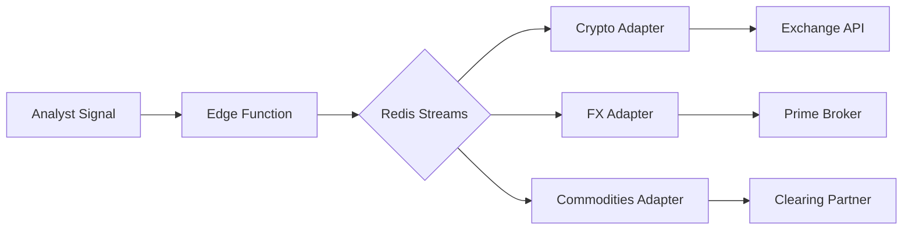

Signals are only valuable when they become fills. Our automation bridge translates discretionary calls from analysts into programmatic orders in under two seconds.

## Architecture overview

1. **Signal ingest** – Analysts publish trade ideas through a structured Telegram form. The payload hits an Edge Function that validates syntax and risk metadata.
2. **Routing** – The message is pushed into a Redis stream partitioned by asset class. This allows crypto, FX, and commodities desks to scale independently.
3. **Execution adapters** – Lightweight workers subscribe to their asset stream, transform the idea into exchange-specific instructions, and fire orders through broker APIs.

## Why this matters

- **Latent risk controls** – Every adapter checks the central risk registry before transmitting an order. If a member has hit daily drawdown, automation pauses instantly.
- **Mentor overrides** – Mentors can inject manual adjustments (size changes, staggered entries) via a control UI without redeploying workers.
- **Audit trail** – Each executed order writes to Supabase with the original signal payload, automation decisions, and broker response for compliance review.

The bridge keeps human discretion in the loop while letting members operate 24/7. When the London desk sleeps, automation continues within the same guardrails analysts established.
