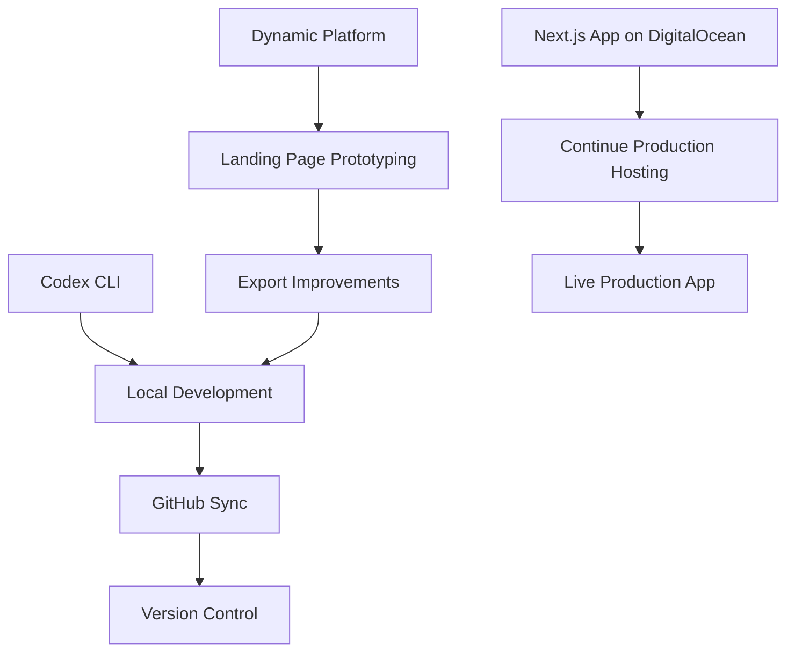

# Hybrid Development Workflow

This guide describes a recommended approach for combining Dynamic prototyping
with traditional local development and production hosting.

## Overview

1. **Maintain production on DigitalOcean** – The live app stays hosted on
   DigitalOcean with Supabase as its backend. Ensure environment variables are
   configured in the hosting platform.
2. **Prototype in Dynamic** – Use Dynamic to design landing pages and UI
   updates. Configure the same environment variables so prototypes mirror
   production.
3. **Export via Codex CLI** – Pull changes from Dynamic into the repository
   using the Codex CLI and run `npm run codex:post-pull` to install
   dependencies, sync environment variables, and execute the combined Dynamic
   build.
4. **Local testing and iteration** – Run `node lovable-dev.js` (or
   `npm run dev:lovable`) to verify environment variables, check Supabase
   connectivity, and preview the app locally.
5. **GitHub sync and version control** – Commit and push changes to GitHub so
   both Dynamic and DigitalOcean stay in sync.
6. **Deployment pipeline** – Merge validated changes to the production branch.
   DigitalOcean rebuilds from GitHub, keeping the live app current with Dynamic
   and local updates.

> 💡 Run `npm run codex:hybrid` to automate the dependency install, environment
> sync, optional build/verify steps, and launch the Dynamic development server
> in one command. Append flags such as `--no-install`, `--no-build`, or
> `--verify` after `--` to customize the workflow.

## Notes

- Keep `.env.example` up to date when new variables are introduced.
- Run `npm test` and `npm run lint` before committing to ensure code quality.
- Use `npm run build:all` or `node lovable-build.js` to compile both the Next.js
  app and mini app functions.
