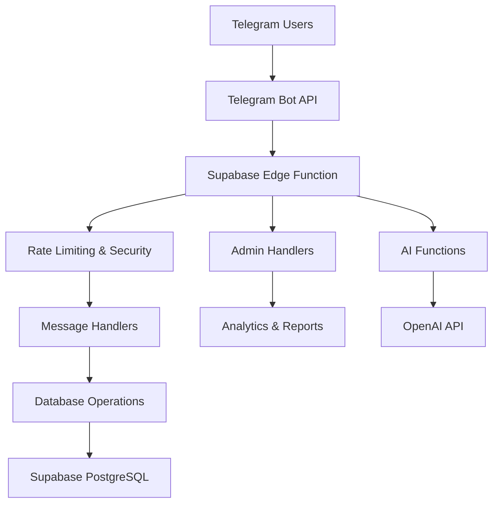

# Dynamic Capital Bot API Documentation

> **AI-Friendly Documentation** - This documentation is optimized for AI code
> generation tools like Codex, ChatGPT, and Bolt.

## 📋 Table of Contents

<!-- TOC:START -->

- [🚀 Project Overview](#project-overview)
  - [Key Features](#key-features)
  - [Technology Stack](#technology-stack)
- [🏗️ Architecture](#architecture)
  - [Core Components](#core-components)
- [📊 Database Schema](#database-schema)
  - [Core Tables](#core-tables)
    - [bot_users](#bot_users)
    - [subscription_plans](#subscription_plans)
    - [bot_content](#bot_content)
  - [Relationships](#relationships)
- [🔌 API Endpoints](#api-endpoints)
  - [Edge Functions](#edge-functions)
    - [1. Telegram Bot (`/telegram-bot`)](#1-telegram-bot-telegram-bot)
    - [2. Analytics Data (`/analytics-data`)](#2-analytics-data-analytics-data)
    - [3. AI FAQ Assistant (`/ai-faq-assistant`)](#3-ai-faq-assistant-ai-faq-assistant)
    - [4. Checkout Init (`/checkout-init`)](#4-checkout-init-checkout-init)
    - [5. Intent (`/intent`)](#5-intent-intent)
    - [6. Plans (`/plans`)](#6-plans-plans)
    - [7. Promo Validate (`/promo-validate`)](#7-promo-validate-promo-validate)
    - [8. Active Promos (`/active-promos`)](#8-active-promos-active-promos)
    - [9. Subscription Status (`/subscription-status`)](#9-subscription-status-subscription-status)
    - [10. Crypto Txid (`/crypto-txid`)](#10-crypto-txid-crypto-txid)
    - [11. Admin Session (`/admin-session`)](#11-admin-session-admin-session)
    - [12. Admin Bans (`/admin-bans`)](#12-admin-bans-admin-bans)
    - [13. Admin Logs (`/admin-logs`)](#13-admin-logs-admin-logs)
    - [14. Admin Act On Payment (`/admin-act-on-payment`)](#14-admin-act-on-payment-admin-act-on-payment)
    - [15. Admin List Pending (`/admin-list-pending`)](#15-admin-list-pending-admin-list-pending)
    - [16. Admin Check (`/admin-check`)](#16-admin-check-admin-check)
    - [17. Bot Status Check (`/bot-status-check`)](#17-bot-status-check-bot-status-check)
    - [18. Rotate Webhook Secret (`/rotate-webhook-secret`)](#18-rotate-webhook-secret-rotate-webhook-secret)
    - [19. Rotate Admin Secret (`/rotate-admin-secret`)](#19-rotate-admin-secret-rotate-admin-secret)
    - [20. Reset Bot (`/reset-bot`)](#20-reset-bot-reset-bot)
    - [21. Broadcast Dispatch (`/broadcast-dispatch`)](#21-broadcast-dispatch-broadcast-dispatch)
    - [22. Build Miniapp (`/build-miniapp`)](#22-build-miniapp-build-miniapp)
    - [23. Upload Miniapp HTML (`/upload-miniapp-html`)](#23-upload-miniapp-html-upload-miniapp-html)
    - [24. Web App Health (`/web-app-health`)](#24-web-app-health-web-app-health)
    - [25. Miniapp Health (`/miniapp-health`)](#25-miniapp-health-miniapp-health)
    - [26. Theme Get (`/theme-get`)](#26-theme-get-theme-get)
    - [27. Theme Save (`/theme-save`)](#27-theme-save-theme-save)
    - [28. Content Batch (`/content-batch`)](#28-content-batch-content-batch)
    - [29. Miniapp (`/miniapp`)](#29-miniapp-miniapp)
    - [30. Verify Initdata (`/verify-initdata`)](#30-verify-initdata-verify-initdata)
- [🤖 Bot Commands](#bot-commands)
  - [User Commands](#user-commands)
    - [`/start`](#start)
    - [`/help`](#help)
    - [`/packages`](#packages)
    - [`/vip`](#vip)
  - [Admin Commands](#admin-commands)
    - [`/admin`](#admin)
- [👨‍💼 Admin Functions](#admin-functions)
  - [Version Notifications](#version-notifications)
  - [Dashboard Management](#dashboard-management)
  - [User Management](#user-management)
  - [Content Management](#content-management)
- [💻 Code Examples](#code-examples)
  - [Creating a New Handler](#creating-a-new-handler)
  - [Database Operations](#database-operations)
  - [Message Formatting](#message-formatting)
- [🛠️ Development Guidelines](#development-guidelines)
  - [Code Style](#code-style)
  - [AI Tool Compatibility](#ai-tool-compatibility)
  - [Security Best Practices](#security-best-practices)
  - [Testing Guidelines](#testing-guidelines)
  - [Performance Optimization](#performance-optimization)
- [🔧 Configuration](#configuration)
  - [Environment Variables](#environment-variables)
  - [Bot Configuration](#bot-configuration)
- [📚 Additional Resources](#additional-resources)
- [🤝 Contributing](#contributing)

<!-- TOC:END -->

---

## 🚀 Project Overview

The Dynamic Capital Bot is a comprehensive Telegram bot built with TypeScript,
Supabase, and Deno Edge Functions. It manages VIP subscriptions, education
packages, payments, and user interactions.

### Key Features

- 👥 User management with VIP tiers
- 💳 Payment processing (manual uploads)
- 📚 Education package enrollment
- 📊 Analytics and reporting
- 🎁 Promotion code system
- 📢 Broadcasting capabilities
- 🔒 Advanced security and rate limiting

### Technology Stack

- **Backend**: Supabase (PostgreSQL + Edge Functions)
- **Runtime**: Deno
- **Language**: TypeScript
- **API**: Telegram Bot API
- **AI Integration**: OpenAI GPT models

---

## 🏗️ Architecture



### Core Components

1. **Main Bot Function** (`telegram-bot/index.ts`)
   - Handles all incoming Telegram updates
   - Routes messages to appropriate handlers
   - Manages user sessions and security

2. **Database Utils** (`telegram-bot/database-utils.ts`)
   - Content and settings management
   - VIP package operations
   - User activity tracking

3. **Admin Handlers** (`telegram-bot/admin-handlers.ts`)
   - Administrative dashboard
   - User management
   - System monitoring

---

## 📊 Database Schema

### Core Tables

#### bot_users

```sql
CREATE TABLE bot_users (
  id UUID PRIMARY KEY DEFAULT gen_random_uuid(),
  telegram_id TEXT UNIQUE NOT NULL,
  username TEXT,
  first_name TEXT,
  last_name TEXT,
  is_admin BOOLEAN DEFAULT false,
  is_vip BOOLEAN DEFAULT false,
  current_plan_id UUID,
  subscription_expires_at TIMESTAMPTZ,
  notes TEXT,
  created_at TIMESTAMPTZ DEFAULT now(),
  updated_at TIMESTAMPTZ DEFAULT now()
);
```

#### subscription_plans

```sql
CREATE TABLE subscription_plans (
  id UUID PRIMARY KEY DEFAULT gen_random_uuid(),
  name TEXT NOT NULL,
  price NUMERIC NOT NULL,
  currency TEXT DEFAULT 'USD',
  duration_months INTEGER NOT NULL,
  is_lifetime BOOLEAN DEFAULT false,
  features TEXT[],
  created_at TIMESTAMPTZ DEFAULT now(),
  updated_at TIMESTAMPTZ DEFAULT now()
);
```

#### bot_content

```sql
CREATE TABLE bot_content (
  id UUID PRIMARY KEY DEFAULT gen_random_uuid(),
  content_key TEXT UNIQUE NOT NULL,
  content_value TEXT NOT NULL,
  content_type TEXT DEFAULT 'text',
  description TEXT,
  is_active BOOLEAN DEFAULT true,
  created_by TEXT,
  last_modified_by TEXT,
  created_at TIMESTAMPTZ DEFAULT now(),
  updated_at TIMESTAMPTZ DEFAULT now()
);
```

### Relationships

- `user_subscriptions` → `bot_users` (many-to-one)
- `payments` → `subscription_plans` (many-to-one)
- `education_enrollments` → `education_packages` (many-to-one)
- `promotion_usage` → `promotions` (many-to-one)
  - Unique usage enforced: each `telegram_user_id` can apply a given promotion
    only once

---

## 🔌 API Endpoints

### Edge Functions

#### 1. Telegram Bot (`/telegram-bot`)

**Primary bot function handling all Telegram interactions**

```typescript
// POST https://your-project.supabase.co/functions/v1/telegram-bot
// Webhook endpoint for Telegram Bot API

interface TelegramWebhookBody {
  update_id: number;
  message?: TelegramMessage;
  callback_query?: TelegramCallbackQuery;
}
```

#### 2. Analytics Data (`/analytics-data`)

**Retrieve bot analytics and statistics**

```typescript
// GET https://your-project.supabase.co/functions/v1/analytics-data
// Returns comprehensive bot statistics

interface AnalyticsResponse {
  total_users: number;
  vip_users: number;
  revenue: number;
  daily_interactions: number;
  // ... more metrics
}
```

#### 3. AI FAQ Assistant (`/ai-faq-assistant`)

**AI-powered FAQ responses using OpenAI**

```typescript
// POST https://your-project.supabase.co/functions/v1/ai-faq-assistant
interface FAQRequest {
  question: string;
  user_id: string;
  context?: string;
}

interface FAQResponse {
  answer: string;
  confidence: number;
  sources?: string[];
}
```

#### 4. Checkout Init (`/checkout-init`)

Initialize a new payment for a subscription plan.

```http
POST /functions/v1/checkout-init
Authorization: Bearer <token> or Telegram initData
Content-Type: application/json

{
  "plan_id": "uuid",
  "method": "bank_transfer"
}

Response:
{
  "payment_id": "123",
  "instructions": {}
}
```

Auth: User token or valid Telegram init data.

#### 5. Intent (`/intent`)

Create a bank or crypto payment intent.

```http
POST /functions/v1/intent
Content-Type: application/json

{
  "initData": "telegram-init-data",
  "type": "bank"
}

Response:
{ "pay_code": "ABC123" }
```

Auth: Telegram init data required.

#### 6. Plans (`/plans`)

Fetch available subscription plans.

```http
GET /functions/v1/plans

Response:
[
  { "id": "uuid", "name": "Monthly", "price": 50 }
]
```

Auth: None.

#### 7. Promo Validate (`/promo-validate`)

Validate a promotion code.

```http
POST /functions/v1/promo-validate
Content-Type: application/json

{ "code": "SUMMER" }

Response:
{ "valid": true, "discount": 10 }
```

Auth: None.

#### 8. Active Promos (`/active-promos`)

List all active promotion codes.

```http
GET /functions/v1/active-promos

Response:
[
  { "code": "SUMMER", "discount": 10 }
]
```

Auth: None.

#### 9. Subscription Status (`/subscription-status`)

Check a user's current subscription.

```http
POST /functions/v1/subscription-status
Authorization: Bearer <token>

{ "telegram_id": "123" }

Response:
{ "active": true, "expires_at": "2024-01-01" }
```

Auth: Bearer token required.

#### 10. Crypto Txid (`/crypto-txid`)

Validate a submitted crypto transaction ID.

```http
POST /functions/v1/crypto-txid
Content-Type: application/json

{ "txid": "abc123" }

Response:
{ "status": "pending" }
```

Auth: None.

#### 11. Admin Session (`/admin-session`)

Generate an admin JWT session token.

```http
POST /functions/v1/admin-session
Content-Type: application/json

{ "initData": "telegram-init-data" }

Response:
{ "token": "jwt" }
```

Auth: Telegram init data from admin user.

#### 12. Admin Bans (`/admin-bans`)

Manage banned users.

```http
POST /functions/v1/admin-bans
Content-Type: application/json

{ "initData": "telegram-init-data" }

Response:
{ "items": [] }
```

Auth: Telegram init data from admin user.

#### 13. Admin Logs (`/admin-logs`)

Retrieve administrative action logs.

```http
POST /functions/v1/admin-logs
Content-Type: application/json

{ "initData": "telegram-init-data" }

Response:
{ "items": [] }
```

Auth: Telegram init data from admin user.

#### 14. Admin Act On Payment (`/admin-act-on-payment`)

Approve or reject a pending payment.

```http
POST /functions/v1/admin-act-on-payment
Content-Type: application/json

{
  "initData": "telegram-init-data",
  "payment_id": "uuid",
  "action": "approve"
}

Response:
{ "ok": true }
```

Auth: Telegram init data from admin user.

#### 15. Admin List Pending (`/admin-list-pending`)

List payments awaiting review.

```http
POST /functions/v1/admin-list-pending
Content-Type: application/json

{ "initData": "telegram-init-data" }

Response:
{ "items": [] }
```

Auth: Telegram init data from admin user.

#### 16. Admin Check (`/admin-check`)

Verify admin status for a user.

```http
POST /functions/v1/admin-check
Content-Type: application/json

{ "initData": "telegram-init-data" }

Response:
{ "admin": true }
```

Auth: Telegram init data required.

#### 17. Bot Status Check (`/bot-status-check`)

Report bot uptime and version.

```http
GET /functions/v1/bot-status-check

Response:
{ "status": "ok", "version": "1.0" }
```

Auth: None.

#### 18. Rotate Webhook Secret (`/rotate-webhook-secret`)

Rotate the Telegram webhook secret token.

```http
POST /functions/v1/rotate-webhook-secret
X-Admin-Secret: <secret>

Response:
{ "new_secret": "..." }
```

Auth: `X-Admin-Secret` header required.

#### 19. Rotate Admin Secret (`/rotate-admin-secret`)

Generate a new admin API secret.

```http
POST /functions/v1/rotate-admin-secret
X-Admin-Secret: <secret>

Response:
{ "new_secret": "..." }
```

Auth: `X-Admin-Secret` header required.

#### 20. Reset Bot (`/reset-bot`)

Reset the bot's runtime state.

```http
POST /functions/v1/reset-bot
X-Admin-Secret: <secret>

Response:
{ "ok": true }
```

Auth: `X-Admin-Secret` header required.

#### 21. Broadcast Dispatch (`/broadcast-dispatch`)

Send a broadcast message to users.

```http
POST /functions/v1/broadcast-dispatch
X-Admin-Secret: <secret>
Content-Type: application/json

{ "message": "Hello" }

Response:
{ "sent": 100 }
```

Auth: `X-Admin-Secret` header required.

#### 22. Build Miniapp (`/build-miniapp`)

Build the Telegram Mini App assets.

```http
POST /functions/v1/build-miniapp
X-Admin-Secret: <secret>

Response:
{ "ok": true }
```

Auth: `X-Admin-Secret` header required.

#### 23. Upload Miniapp HTML (`/upload-miniapp-html`)

Upload built Mini App HTML to storage.

```http
POST /functions/v1/upload-miniapp-html
X-Admin-Secret: <secret>

Response:
{ "ok": true }
```

Auth: `X-Admin-Secret` header required.

#### 24. Web App Health (`/web-app-health`)

Health check for the web dashboard.

```http
GET /functions/v1/web-app-health

Response:
{ "status": "ok" }
```

Auth: None.

#### 25. Miniapp Health (`/miniapp-health`)

Health check for the Mini App.

```http
GET /functions/v1/miniapp-health

Response:
{ "status": "ok" }
```

Auth: None.

#### 26. Theme Get (`/theme-get`)

Retrieve the persisted theme preference for the signed-in user. The edge
function decodes the Supabase JWT, loads the `theme:<uid>` record from
`bot_settings`, and falls back to `auto` (system) when no preference has been
stored.

```http
GET /functions/v1/theme-get
Authorization: Bearer <token>

Response:
{ "mode": "auto" }
```

- **mode** – `"auto"`, `"light"`, or `"dark"`; the value is consumed by the
  `useTheme` hook in `apps/web/hooks/useTheme.tsx` to align the dashboard and
  Telegram Mini App shells.

Auth: Bearer token required.

#### 27. Theme Save (`/theme-save`)

Persist a new theme preference for the signed-in user. The handler uses the
service role (if available) or anon key to upsert the `theme:<uid>` record in
`bot_settings`. Invalid modes return `400`.

```http
POST /functions/v1/theme-save
Authorization: Bearer <token>
Content-Type: application/json

{ "mode": "dark" }

Response:
{ "ok": true }
```

- **mode** – Required; must be `"auto"`, `"light"`, or `"dark"`.
- The Mini App and dashboard call this endpoint after toggling the theme so the
  next session rehydrates with the same appearance.

Auth: Bearer token required.

#### 28. Content Batch (`/content-batch`)

Fetch multiple content entries at once.

```http
POST /functions/v1/content-batch
Content-Type: application/json

{ "keys": ["welcome", "help"] }

Response:
{ "welcome": "Hi", "help": "..." }
```

Auth: None.

#### 29. Miniapp (`/miniapp`)

Serve the Telegram Mini App configuration.

```http
GET /functions/v1/miniapp

Response:
{ "ok": true }
```

Auth: None.

#### 30. Verify Initdata (`/verify-initdata`)

Verify and decode Telegram `initData` payloads.

```http
POST /functions/v1/verify-initdata
Content-Type: application/json

{ "initData": "telegram-init-data" }

Response:
{ "valid": true, "user_id": "123" }
```

Auth: None.

---

## 🤖 Bot Commands

### User Commands

#### `/start`

Initialize bot session and show welcome message

```typescript
async function handleStartCommand(message: TelegramMessage): Promise<void> {
  const userId = message.from?.id.toString();
  const chatId = message.chat.id;

  // Create/update user in database
  // Show welcome message with main menu
  // Start user session
}
```

#### `/help`

Display help information and available commands

```typescript
async function handleHelpCommand(chatId: number): Promise<void> {
  const helpContent = await getBotContent("help_message");
  await sendMessage(chatId, helpContent);
}
```

#### `/packages`

Show available VIP packages and subscription options with interactive buttons
that let the user start the checkout flow.

```typescript
async function handlePackagesCommand(chatId: number): Promise<void> {
  const msg = await getFormattedVipPackages();
  const pkgs = await getVipPackages();
  const inline_keyboard = pkgs.map((pkg) => [{
    text: pkg.name,
    callback_data: "buy:" + pkg.id,
  }]);
  inline_keyboard.push([{ text: "Back", callback_data: "menu:home" }]);
  await sendMessage(chatId, msg, {
    parse_mode: "Markdown",
    reply_markup: { inline_keyboard },
  });
}
```

#### `/vip`

Display VIP membership benefits

```typescript
async function handleVipCommand(chatId: number): Promise<void> {
  const msg = await getBotContent("vip_benefits");
  await sendMessage(chatId, msg);
}
```

### Admin Commands

#### `/admin`

Access admin dashboard (admin only)

```typescript
async function handleAdminCommand(
  chatId: number,
  userId: string,
): Promise<void> {
  if (!isAdmin(userId)) {
    await sendMessage(chatId, "❌ Access denied.");
    return;
  }

  await handleAdminDashboard(chatId, userId);
}
```

---

## 👨‍💼 Admin Functions

### Version Notifications

The bot tracks its code version (bot number) using the `BOT_VERSION` environment
variable. When a new version is deployed, all admins receive a message with the
updated version and the bot automatically refreshes its configuration and
prompts. Admins also receive the current bot number and a status report whenever
they start a new session with `/start`, ensuring the bot number stays current
with each development.

### Dashboard Management

```typescript
/**
 * Display comprehensive admin dashboard
 * Shows system stats, user metrics, and management options
 */
async function handleAdminDashboard(
  chatId: number,
  userId: string,
): Promise<void> {
  // Get system statistics
  const stats = await getDashboardStats();

  // Format admin message
  const adminMessage = formatAdminDashboard(stats);

  // Create admin keyboard
  const keyboard = createAdminKeyboard();

  await sendMessage(chatId, adminMessage, keyboard);
}
```

### User Management

```typescript
/**
 * Manage bot users - view, edit, promote to VIP/admin
 */
async function handleUserTableManagement(
  chatId: number,
  userId: string,
): Promise<void> {
  const users = await getBotUsers({ limit: 50, orderBy: "created_at" });
  const userList = formatUserList(users);

  await sendMessage(chatId, userList, getUserManagementKeyboard());
}
```

### Content Management

```typescript
/**
 * Edit bot messages, welcome text, FAQ responses
 */
async function handleContentManagement(
  chatId: number,
  userId: string,
): Promise<void> {
  const content = await getBotContentList();
  const contentMenu = formatContentMenu(content);

  await sendMessage(chatId, contentMenu, getContentKeyboard());
}
```

---

## 💻 Code Examples

### Creating a New Handler

```typescript
/**
 * Template for creating new bot handlers
 * Copy this template and modify for your specific needs
 */
async function handleNewFeature(
  chatId: number,
  userId: string,
  data?: string,
): Promise<void> {
  try {
    // 1. Validate user permissions
    if (!isAuthorized(userId)) {
      await sendMessage(chatId, "❌ Access denied.");
      return;
    }

    // 2. Get required data from database
    const userData = await getUserData(userId);
    const settings = await getBotSettings(["feature_enabled", "max_usage"]);

    // 3. Process the request
    const result = await processFeatureRequest(userData, data);

    // 4. Update database if needed
    await updateUserActivity(userId, { feature_used: "new_feature" });

    // 5. Send response to user
    const responseMessage = formatFeatureResponse(result);
    const keyboard = createFeatureKeyboard(result);

    await sendMessage(chatId, responseMessage, keyboard);

    // 6. Log admin action if applicable
    if (isAdmin(userId)) {
      await logAdminAction(userId, "feature_access", "Used new feature");
    }
  } catch (error) {
    console.error("🚨 Error in handleNewFeature:", error);
    await sendMessage(chatId, "❌ An error occurred. Please try again.");
  }
}
```

### Database Operations

```typescript
/**
 * Example database operations using Supabase client
 */

// Create a new record
async function createUser(userData: Partial<BotUser>): Promise<BotUser | null> {
  const { data, error } = await supabaseAdmin
    .from("bot_users")
    .insert(userData)
    .select()
    .single();

  if (error) {
    console.error("❌ Error creating user:", error);
    return null;
  }

  return data;
}

// Update existing record
async function updateUserVipStatus(
  userId: string,
  isVip: boolean,
): Promise<boolean> {
  const { error } = await supabaseAdmin
    .from("bot_users")
    .update({
      is_vip: isVip,
    })
    .eq("telegram_id", userId);

  return !error;
}

// Complex query with joins
async function getUserSubscriptionData(userId: string): Promise<any> {
  const { data, error } = await supabaseAdmin
    .from("user_subscriptions")
    .select(`
      *,
      subscription_plans(name, price, features),
      payments(amount, status, created_at)
    `)
    .eq("telegram_user_id", userId)
    .eq("is_active", true);

  return error ? null : data;
}
```

### Message Formatting

```typescript
/**
 * Message formatting utilities for consistent UX
 */

function formatUserList(users: BotUser[]): string {
  return `👥 **User Management**

📊 **Total Users:** ${users.length}

${
    users.map((user, index) =>
      `${index + 1}. ${user.first_name || "Unknown"} (@${
        user.username || "no_username"
      })
   • ID: \`${user.telegram_id}\`
   • Status: ${user.is_vip ? "💎 VIP" : "👤 Regular"}
   • Joined: ${formatDate(user.created_at)}`
    ).join("\n\n")
  }`;
}

function createInlineKeyboard(
  buttons: Array<{ text: string; data: string }>,
): TelegramInlineKeyboardMarkup {
  return {
    inline_keyboard: buttons.map((btn) => [{
      text: btn.text,
      callback_data: btn.data,
    }]),
  };
}
```

---

## 🛠️ Development Guidelines

### Code Style

- Use TypeScript strict mode
- Follow JSDoc comment conventions
- Use descriptive variable and function names
- Implement proper error handling
- Add logging for debugging

### AI Tool Compatibility

- All functions have comprehensive JSDoc comments
- TypeScript interfaces for all data structures
- Clear separation of concerns
- Consistent naming conventions
- Well-documented configuration

### Security Best Practices

- Rate limiting on all endpoints
- Input validation and sanitization
- Admin permission checks
- SQL injection prevention (use Supabase client)
- Sensitive data encryption

### Testing Guidelines

```typescript
/**
 * Example test structure for new features
 */
describe("New Feature Handler", () => {
  it("should handle valid user request", async () => {
    const mockChatId = 123456;
    const mockUserId = "test_user";

    // Mock database responses
    jest.spyOn(supabaseAdmin, "from").mockReturnValue(mockQuery);

    // Test the handler
    await handleNewFeature(mockChatId, mockUserId);

    // Verify expected behavior
    expect(sendMessage).toHaveBeenCalledWith(mockChatId, expect.any(String));
  });
});
```

### Performance Optimization

- Use database functions for complex queries
- Implement caching for frequently accessed data
- Batch operations when possible
- Optimize keyboard layouts for mobile

---

## 🔧 Configuration

### Environment Variables

```bash
# Required
TELEGRAM_BOT_TOKEN=your_bot_token_here
SUPABASE_URL=https://your-project.supabase.co
SUPABASE_SERVICE_ROLE_KEY=your_service_role_key

# Optional
OPENAI_API_KEY=your_openai_key_for_ai_features
```

### Bot Configuration

```typescript
const BOT_CONFIG = {
  // Rate limiting
  MAX_REQUESTS_PER_MINUTE: 20,
  MAX_COMMANDS_PER_MINUTE: 8,

  // Security
  AUTO_BLOCK_DURATION: 300000, // 5 minutes
  MAX_MESSAGE_LENGTH: 4000,

  // Features
  ENABLE_AI_RESPONSES: true,
  ENABLE_PAYMENT_PROCESSING: true,
  ENABLE_BROADCASTING: true,
};
```

---

## 📚 Additional Resources

- [Telegram Bot API Documentation](https://core.telegram.org/bots/api)
- [Supabase Documentation](https://supabase.com/docs)
- [TypeScript Handbook](https://www.typescriptlang.org/docs/)
- [Deno Manual](https://deno.land/manual)

---

## 🤝 Contributing

This codebase is designed to be easily understood and modified by AI tools. When
making changes:

1. Update type definitions in `types/telegram-bot.ts`
2. Add JSDoc comments to new functions
3. Follow the existing code patterns
4. Update this documentation
5. Test with multiple AI tools for compatibility

---

_This documentation is optimized for AI code generation tools. All functions,
interfaces, and patterns are designed to be easily understood and extended by
Codex, ChatGPT, Bolt, and similar AI assistants._
