# Dynamic Capital Web3 App Flow & Onboarding Screens

This document translates the latest sitemap into an actionable flowchart and a set of onboarding screen blueprints. Use it alongside [`docs/web-site-map.md`](./web-site-map.md) to keep navigation, automation hooks, and integrations synchronized.

## Unified Navigation Flow

```mermaid
flowchart TD
    Home["Home Dashboard\nHeader + Sidebar"] --> Market["Dynamic Market"]
    Home --> Signals["Dynamic Signals"]
    Home --> LearnEarn["Dynamic Learn & Earn"]
    Home --> Settings["Settings & Profile"]

    Market --> MarketWatchlist["Market Watchlist\n(DCT pairs, trends, alerts)"]
    Market --> MarketSnapshot["Market Snapshot\nMomentum, Volatility, Heatmap"]
    Market --> MarketOverview["Market Overview\nTrend cards & panels"]

    Signals --> PortfolioSummary["Portfolio Summary\nBalance & P/L"]
    Signals --> Actions["Trade Actions\nTransfer / Pool Trading"]
    Signals --> LiveWallet["Live Wallet\nAddress, Balance, Volume"]

    LearnEarn --> Mentorship["Mentorship Modules\nDynamic, Free, Web3, Literacy"]
    LearnEarn --> GrowthTracker["Growth Tracker\nROI, Balance, Connect"]
    LearnEarn --> Promotions["Promotions\nSeasonal offers"]

    Settings --> Language["Language Toggle\nDhivehi-first"]
    Settings --> Notifications["Notifications"]
    Settings --> WalletIntegration["Wallet Integration"]
    Settings --> Compliance["Compliance & Privacy"]

    subgraph Future[Future Expansion]
        Oracle["Intelligence Oracle"]
        Oracle --> AGIScoring["AGI Scoring Dashboard"]
        Oracle --> Quantum["Quantum Module Sync"]
        Oracle --> TelegramBot["Telegram Bot Integration"]
        Oracle --> FeedbackLoop["Feedback Loop Visualizer"]
    end

    Signals -.-> Oracle
    Market -.-> Oracle
    LearnEarn -.-> Oracle
```

The dashed connections indicate candidate data sources for the future Intelligence Oracle, reinforcing where real-time metrics can enrich AGI scoring and automation.

## Onboarding Screen Blueprint

| Screen | Primary Goal | Hero Content | Key Components | Automation & Analytics |
| ------ | ------------- | ------------ | --------------- | ---------------------- |
| **Welcome Launchpad** | Orient newcomers with the Dynamic Capital value promise. | Headline + subheadline matching marketing copy, localized Dhivehi toggle, primary **Continue to Home** CTA. | Social proof cards, countdown-style clock, language switcher tooltip. | Track `cta_continue_home_clicked`; hydrate localization preference for downstream sessions. |
| **Personal Home Hub** | Surface top actions after first login. | Personalized greeting from mentorship lead, highlight of DCT balance snapshot. | Quick-start checklist, mini watchlist, Learn & Earn teaser tile. | Fetch `/api/welcome-context`; emit `cta_explore_home_clicked` when checklist launched. |
| **Signals Primer** | Explain how dynamic signals drive confident trades. | Animated signal strength meter with Dhivehi legend. | Portfolio summary widget, long/short ratios, mentor commentary feed. | Connect to Supabase real-time stream; label analytics with `signals_stream_engaged`. |
| **Learn & Earn Invitation** | Motivate ongoing education and mentorship enrollment. | Rotating mentorship avatars with cultural motifs. | Module carousel (Dynamic Mentorship, Free Course, Web3 Education, DC Token Literacy), ROI tracker, Connect Wallet CTA. | Start drip campaign via Gmail API when **Connect Wallet** tapped; sync Telegram tag for follow-up. |

## Future-facing Wireframe Notes

- **Intelligence Oracle integration**: reserve a tertiary navigation icon and modal entry point on the Home dashboard. The AGI scoring dashboard should ingest market momentum, wallet health, and mentorship progress simultaneously.
- **Mentorship proof logic**: log completion artifacts (quizzes, webinars, mentorship chats) against the learner profile to unlock tiered rewards in the Learn & Earn module.
- **Dhivehi-first localization**: ensure typography scales for Thaana script across hero, navigation, and data tables. Reuse the toggle state for compliance notifications to avoid redundant prompts.

## Implementation Checklist

1. Align UI kit tokens (color, spacing, iconography) across Market, Signals, and Learn & Earn sections before building the flow.
2. Define event schemas for every CTA above so analytics teams can stitch cohort journeys between web and Telegram experiences.
3. Coordinate integrations:
   - **Signals** → Supabase + TradingView for real-time metrics, with alert icons mapping to severity tokens.
   - **Learn & Earn** → Gmail API + Telegram for drip campaigns and mentorship reminders.
   - **Market** → Oracle feeds to populate localized token names and smart alerts.
   - **Wallet** → MetaMask and TON Wallet sync, labelled with Dhivehi descriptors for clarity.
4. Document dependencies and API contracts in the shared integration playbook to accelerate the Intelligence Oracle roadmap.

Use this flow and onboarding outline as the backbone for interactive prototypes or developer stories.
