# Dynamic Capital Web3 App Flow & Onboarding Screens

This document translates the latest sitemap into an actionable flowchart and a
set of onboarding screen blueprints. Use it alongside
[`docs/web-site-map.md`](./web-site-map.md) to keep navigation, automation
hooks, and integrations synchronized.

## Snapshot

- **Primary objective**: keep design, product, and engineering teams aligned on
  navigation, onboarding intent, instrumentation, and integration requirements
  for the Dynamic Capital Web3 experience.
- **Key outputs**: the Mermaid flow below, onboarding journey specs, and a
  module interaction matrix to operationalize automation hooks across Market,
  Signals, Learn & Earn, and Settings surfaces.
- **Stakeholder touchpoints**: Growth (Learn & Earn), Trading (Market +
  Signals), Compliance (Settings), and the Intelligence Oracle workstream.

## Unified Navigation Flow

```mermaid
flowchart TD
    Home["Home Dashboard\nHeader + Sidebar"] --> Market["Dynamic Market"]
    Home --> Signals["Dynamic Signals"]
    Home --> LearnEarn["Dynamic Learn & Earn"]
    Home --> Settings["Settings & Profile"]

    Market --> MarketWatchlist["Market Watchlist\n(DCT pairs, trends, alerts)"]
    Market --> MarketSnapshot["Market Snapshot\nMomentum, Volatility, Heatmap"]
    Market --> MarketOverview["Market Overview\nTrend cards & panels"]

    Signals --> PortfolioSummary["Portfolio Summary\nBalance & P/L"]
    Signals --> Actions["Trade Actions\nTransfer / Pool Trading"]
    Signals --> LiveWallet["Live Wallet\nAddress, Balance, Volume"]

    LearnEarn --> Mentorship["Mentorship Modules\nDynamic, Free, Web3, Literacy"]
    LearnEarn --> GrowthTracker["Growth Tracker\nROI, Balance, Connect"]
    LearnEarn --> Promotions["Promotions\nSeasonal offers"]

    Settings --> Language["Language Toggle\nDhivehi-first"]
    Settings --> Notifications["Notifications"]
    Settings --> WalletIntegration["Wallet Integration"]
    Settings --> Compliance["Compliance & Privacy"]

    subgraph Future[Future Expansion]
        Oracle["Intelligence Oracle"]
        Oracle --> AGIScoring["AGI Scoring Dashboard"]
        Oracle --> Quantum["Quantum Module Sync"]
        Oracle --> TelegramBot["Telegram Bot Integration"]
        Oracle --> FeedbackLoop["Feedback Loop Visualizer"]
    end

    Signals -.-> Oracle
    Market -.-> Oracle
    LearnEarn -.-> Oracle
```

The dashed connections indicate candidate data sources for the future
Intelligence Oracle, reinforcing where real-time metrics can enrich AGI scoring
and automation.

## Onboarding Screen Blueprint

| Screen                      | Primary Goal                                             | Hero Content                                                                                                | Key Components                                                                                                         | Automation & Analytics                                                                             |
| --------------------------- | -------------------------------------------------------- | ----------------------------------------------------------------------------------------------------------- | ---------------------------------------------------------------------------------------------------------------------- | -------------------------------------------------------------------------------------------------- |
| **Welcome Launchpad**       | Orient newcomers with the Dynamic Capital value promise. | Headline + subheadline matching marketing copy, localized Dhivehi toggle, primary **Continue to Home** CTA. | Social proof cards, countdown-style clock, language switcher tooltip.                                                  | Track `cta_continue_home_clicked`; hydrate localization preference for downstream sessions.        |
| **Personal Home Hub**       | Surface top actions after first login.                   | Personalized greeting from mentorship lead, highlight of DCT balance snapshot.                              | Quick-start checklist, mini watchlist, Learn & Earn teaser tile.                                                       | Fetch `/api/welcome-context`; emit `cta_explore_home_clicked` when checklist launched.             |
| **Signals Primer**          | Explain how dynamic signals drive confident trades.      | Animated signal strength meter with Dhivehi legend.                                                         | Portfolio summary widget, long/short ratios, mentor commentary feed.                                                   | Connect to Supabase real-time stream; label analytics with `signals_stream_engaged`.               |
| **Learn & Earn Invitation** | Motivate ongoing education and mentorship enrollment.    | Rotating mentorship avatars with cultural motifs.                                                           | Module carousel (Dynamic Mentorship, Free Course, Web3 Education, DC Token Literacy), ROI tracker, Connect Wallet CTA. | Start drip campaign via Gmail API when **Connect Wallet** tapped; sync Telegram tag for follow-up. |

## Onboarding Journey Sequence

1. **Discovery → Welcome Launchpad**
   - Trigger: first-time wallet connect or marketing CTA.
   - Data preload: localization preference, referral code, and expected asset
     focus (trader vs. learner).
   - KPIs: `cta_continue_home_clicked`, time-to-first action, Dhivehi toggle
     adoption.
2. **Welcome Launchpad → Personal Home Hub**
   - Trigger: continue CTA or checklist auto-progress.
   - Data preload: snapshot of DCT balance (if connected), recommended Signals
     watchlist, mentorship tier suggestion.
   - KPIs: `cta_explore_home_clicked`, watchlist pin rate, ROI widget hover
     events.
3. **Personal Home Hub → Signals Primer**
   - Trigger: selecting Signals tile, mentor prompt, or alert notification.
   - Data preload: Supabase stream session token, TradingView alert context,
     Dhivehi commentary thread.
   - KPIs: `signals_stream_engaged`, alert follow-through, mentorship chat
     opens.
4. **Signals Primer → Learn & Earn Invitation**
   - Trigger: education CTA, automation from portfolio loss thresholds, or
     Oracle recommendation.
   - Data preload: mentorship availability, Gmail drip status, Telegram tagging,
     ROI baseline.
   - KPIs: `learn_invite_wallet_connected`, module enrollment conversions, drip
     open rates.

## Module Interaction Blueprint

| Module                   | Core Views                                                             | Data Inputs                                                      | Automation Hooks                                                              | Integration Targets                                              |
| ------------------------ | ---------------------------------------------------------------------- | ---------------------------------------------------------------- | ----------------------------------------------------------------------------- | ---------------------------------------------------------------- |
| **Dynamic Market**       | Market Watchlist, Snapshot, Overview panels                            | Oracle pricing feeds, localized token labels, volatility metrics | Smart alerts, price momentum badges, heatmap refresh cadence                  | TradingView overlays, Oracle data lake, localization service     |
| **Dynamic Signals**      | Portfolio Summary, Trade Actions, Live Wallet                          | Supabase real-time signals, wallet sync, mentor commentary       | Alert routing, transfer reminders, AGI score contributions                    | Supabase, MetaMask / TON wallet bridge, PostHog analytics        |
| **Dynamic Learn & Earn** | Mentorship Modules, Growth Tracker, Promotions                         | Mentorship CMS, course completion data, ROI tracker inputs       | Drip campaign sequencer, reward unlocks, Telegram nudges                      | Gmail API, Telegram bot, Supabase profile store                  |
| **Settings & Profile**   | Language, Notifications, Wallet Integration, Compliance                | Localization preferences, notification matrix, KYC status        | Dhivehi-first toggle persistence, compliance reminders, wallet binding events | MetaMask/TON connectors, compliance ledger, localization service |
| **Intelligence Oracle**  | AGI Scoring Dashboard, Quantum Sync, Telegram bot, Feedback Visualizer | Aggregated signals, mentorship progress, compliance data         | Scoring recalculations, predictive prompts, anomaly alerts                    | AGI engine, Supabase analytics warehouse, PostHog funnels        |

## Future-facing Wireframe Notes

- **Intelligence Oracle integration**: reserve a tertiary navigation icon and
  modal entry point on the Home dashboard. The AGI scoring dashboard should
  ingest market momentum, wallet health, and mentorship progress simultaneously.
- **Mentorship proof logic**: log completion artifacts (quizzes, webinars,
  mentorship chats) against the learner profile to unlock tiered rewards in the
  Learn & Earn module.
- **Dhivehi-first localization**: ensure typography scales for Thaana script
  across hero, navigation, and data tables. Reuse the toggle state for
  compliance notifications to avoid redundant prompts.

## Intelligence Oracle Enablement

- **Data ingestion**
  - Market momentum snapshots (`market_momentum_stream` topic) sampled every 5
    minutes for AGI score smoothing.
  - Signals alert ledger with provenance metadata (`signals_alert_feed`) to
    trace recommendations back to TradingView triggers.
  - Learn & Earn mastery ledger capturing quiz/webinar artifacts and mentorship
    transcripts (`mentorship_proof_log`).
- **Computation & scoring**
  - Baseline scoring weights: 40% trading discipline (Signals), 35% educational
    progress (Learn & Earn), 25% wallet health (Settings + Market risk posture).
  - Incorporate qualitative mentor feedback as modifiers (±10%) with
    explainability tags surfaced in the dashboard tooltip.
- **Experience surfaces**
  - Home dashboard badge summarizing the current AGI tier and next best action.
  - Oracle modal with drill-down tabs (Momentum, Mentorship, Compliance) that
    share styling tokens with the primary modules.
  - Telegram bot notifications that mirror AGI recommendations and include
    quick-action deep links back to the web app.
- **Compliance & governance**
  - Capture consent state for AGI insights and store in the compliance ledger
    alongside privacy policy acknowledgements.
  - Version integration contracts in the shared playbook; include data retention
    SLAs for each upstream source.

## Implementation Checklist

1. Align UI kit tokens (color, spacing, iconography) across Market, Signals, and
   Learn & Earn sections before building the flow.
2. Define event schemas for every CTA above so analytics teams can stitch cohort
   journeys between web and Telegram experiences.
3. Coordinate integrations:
   - **Signals** → Supabase + TradingView for real-time metrics, with alert
     icons mapping to severity tokens.
   - **Learn & Earn** → Gmail API + Telegram for drip campaigns and mentorship
     reminders.
   - **Market** → Oracle feeds to populate localized token names and smart
     alerts.
   - **Wallet** → MetaMask and TON Wallet sync, labelled with Dhivehi
     descriptors for clarity.
4. Document dependencies and API contracts in the shared integration playbook to
   accelerate the Intelligence Oracle roadmap.

Use this flow and onboarding outline as the backbone for interactive prototypes
or developer stories.
