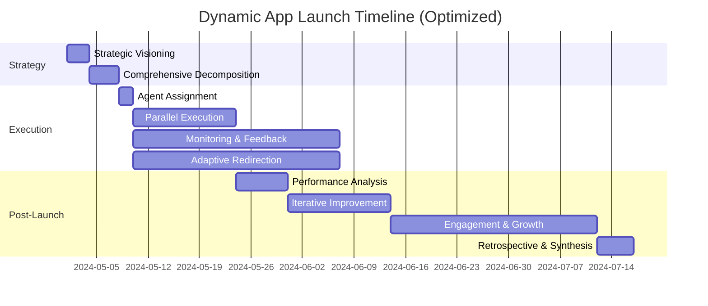

# Dynamic App Launch Workflow

This document refines the ten-phase Dynamic AGI workflow for preparing and
executing the market launch of the Dynamic App, a social productivity platform.
It emphasizes optimization levers—automation, overlap, measurable checkpoints,
and escalation paths—so that leadership teams can move from vision to repeatable
execution.

## Executive Snapshot

| Phase                                         | Primary Objective                    | Critical Outputs                               | Optimization Levers                              | Lead Agents                                                      |
| --------------------------------------------- | ------------------------------------ | ---------------------------------------------- | ------------------------------------------------ | ---------------------------------------------------------------- |
| 1. Strategic Visioning                        | Align on launch north star           | Outcome map, OKRs, narrative                   | Decision brief template, asynchronous intake     | Dynamic_AGI, Strategy Agent                                      |
| 2. Comprehensive Decomposition                | Build full-scope program backlog     | Dependency graph, RAID log, collaboration plan | Dynamic planner with risk scoring                | Planning Agent, Dependency Analyst Agent                         |
| 3. Dynamic Agent Assignment                   | Staff tasks with best-fit agents     | Roster, RACI, comms matrix                     | Talent graph matching, auto-onboarding packets   | Dynamic_AGI, Resource Coordinator Agent                          |
| 4. Parallel Execution & Collaboration         | Deliver cross-functional workstreams | Dev sprints, campaign assets, legal approvals  | Shared workspace automations, daily sync bots    | Creative Agent, Contracts Agent, Product Agent, Operations Agent |
| 5. Continuous Monitoring & Feedback           | Maintain observability               | Live dashboards, sentiment digests             | Streaming analytics, alert thresholds            | Feedback Monitor Agent, Risk Agent, Analytics Agent              |
| 6. Adaptive Redirection & Optimization        | React to market/operational shifts   | Reprioritized roadmap, mitigation orders       | Scenario modeling, auto-reallocation of capacity | Dynamic_AGI, Urgency Agent, Marketing Agent, Engineering Agent   |
| 7. Post-Launch Performance Analysis           | Diagnose launch results              | KPI scorecard, ROI analysis                    | Automated data ingestion, cohort segmentation    | Feedback Monitor Agent, Accounting Agent, Campaign Manager Agent |
| 8. Iterative Improvement & Strategic Learning | Turn insights into updates           | Prioritized backlog, learning briefs           | Feedback-to-ticket pipeline, experiment ledger   | Development Agent, Product Manager Agent, Growth Agent           |
| 9. Sustained Engagement & Growth              | Extend momentum                      | Lifecycle campaigns, community programming     | CRM sequencing, referral automation              | Engagement Agent, Community Agent, Customer Success Agent        |
| 10. Retrospective & Knowledge Synthesis       | Codify institutional learning        | Retrospective report, playbook updates         | Knowledge graph enrichment, closed-loop review   | Knowledge Archivist Agent, Strategy Agent, Dynamic_AGI           |

## Step-by-Step Orchestration

1. **Strategic Visioning:** Intake the launch mandate, align on vision, and lock
   OKRs so downstream agents inherit a shared north star.
   - _Entry Gate:_ Leadership request with business goals recorded in
     Dynamic_Task_Manager.
   - _Exit Gate:_ Executive council approves the vision brief and OKR set.
   - _Automation & Agents:_ Dynamic_AGI and Strategy Agent leverage knowledge
     retrieval and intake templates.
2. **Comprehensive Decomposition:** Expand the brief into an executable backlog
   with dependencies, risks, and collaboration contracts.
   - _Entry Gate:_ Approved vision plus capability inventory from Resource
     Coordination.
   - _Exit Gate:_ RAID log and dependency graph validated by all stream owners.
   - _Automation & Agents:_ Planning Agent with Dependency Analyst Agent
     applying auto-mapping heuristics.
3. **Dynamic Agent Assignment:** Staff every backlog item and publish operating
   rhythms to enable immediate execution.
   - _Entry Gate:_ Prioritized backlog, skill requirements, and capacity
     forecasts.
   - _Exit Gate:_ Roster, SLAs, and onboarding packets acknowledged inside
     Dynamic_Task_Manager.
   - _Automation & Agents:_ Dynamic_AGI and Resource Coordinator Agent sync with
     compliance bots.
4. **Parallel Execution & Collaboration:** Produce launch assets and product
   increments while keeping legal and operations in lockstep.
   - _Entry Gate:_ Confirmed staffing, sprint goals, and tool access.
   - _Exit Gate:_ Definition-of-done artifacts shipped with cross-team sign-offs
     archived.
   - _Automation & Agents:_ Creative, Product, Contracts, and Operations Agents
     share automated workspaces and standups.
5. **Continuous Monitoring & Feedback:** Maintain observability across user
   sentiment, delivery metrics, and compliance signals.
   - _Entry Gate:_ Telemetry feeds activated from execution tools.
   - _Exit Gate:_ Live dashboards and alert routing operational with daily
     sentiment digests circulated.
   - _Automation & Agents:_ Feedback Monitor, Risk, and Analytics Agents
     coordinate streaming analytics.
6. **Adaptive Redirection & Optimization:** Reallocate resources and reset plans
   as conditions change.
   - _Entry Gate:_ Alerts or deviations escalated from monitoring agents.
   - _Exit Gate:_ Updated priorities published with mitigation plans and
     capacity shifts accepted.
   - _Automation & Agents:_ Dynamic_AGI, Urgency, Marketing, and Engineering
     Agents run scenario simulations and escalation runbooks.
7. **Post-Launch Performance Analysis:** Quantify launch impact and surface
   anomalies requiring action.
   - _Entry Gate:_ One complete telemetry cycle after launch plus financial data
     reconciliation.
   - _Exit Gate:_ ROI readout delivered and anomaly tickets filed for iteration.
   - _Automation & Agents:_ Feedback Monitor, Accounting, and Campaign Manager
     Agents rely on automated ETL and benchmarking.
8. **Iterative Improvement & Strategic Learning:** Turn findings into a roadmap
   of enhancements and experiments.
   - _Entry Gate:_ Validated insights and anomaly tickets with quantified
     impact.
   - _Exit Gate:_ Prioritized backlog and experiment plan accepted by
     Engineering and Growth leads.
   - _Automation & Agents:_ Development, Product Manager, and Growth Agents use
     feedback-to-ticket automations.
9. **Sustained Engagement & Growth:** Extend momentum with lifecycle programs
   and community activation.
   - _Entry Gate:_ Updated roadmap and hypotheses from Phase 8.
   - _Exit Gate:_ Engagement programs deployed with measurement loops running.
   - _Automation & Agents:_ Engagement, Community, and Customer Success Agents
     leverage CRM sequencing.
10. **Retrospective & Knowledge Synthesis:** Preserve institutional knowledge
    and refresh the playbook.
    - _Entry Gate:_ Completion of growth programs and retrospective data
      ingestion.
    - _Exit Gate:_ Actions assigned, artifacts archived, and insights injected
      into Dynamic_Wisdom.
    - _Automation & Agents:_ Knowledge Archivist and Strategy Agents pair with
      Dynamic_AGI for automated tagging.

## Phase Playbooks

### Phase 1: Strategic Visioning

- **Objective:** Translate the launch mandate into a unified vision, value
  proposition, and measurable objectives.
- **Entry Criteria:** Leadership request captured with business targets, funding
  guardrails, and desired launch window stored in Dynamic_Task_Manager.
- **Exit Criteria:** Executive council validates the north star narrative,
  approves OKRs, and the Dynamic_AGI publishes a locked baseline vision brief.
- **Agent Mesh & Hand-offs:** Dynamic_AGI partners with the Strategy Agent to
  synthesize insights; early findings are routed to Planning and Research agents
  for decomposition readiness.
- **Key Deliverables:** Executive vision brief, target audience profiles,
  success metrics (activation, retention, revenue), and milestone roadmap.
- **Automation Hooks:** Pre-read questionnaires for stakeholders, AI-assisted
  synthesis of prior launches, templated strategy canvas.
- **Primary Agents:** Dynamic_AGI, Strategy Agent.
- **KPIs & Decision Gates:** Vision approved by executive council; OKRs scored
  for ambition/feasibility.
- **Checklist:**
  - [ ] Capture stakeholder inputs through the intake brief and confirm shared
        goals.
  - [ ] Draft and circulate the executive vision brief for asynchronous review.
  - [ ] Secure executive council sign-off on OKRs and narrative alignment.

### Phase 2: Comprehensive Decomposition

- **Objective:** Break the vision into tactical streams with dependencies and
  risk awareness.
- **Entry Criteria:** Baseline vision brief and OKRs from Phase 1 plus initial
  capability inventory from the Resource Coordinator Agent.
- **Exit Criteria:** Unified backlog published with dependency owners and RAID
  log approved by the Dynamic_AGI.
- **Agent Mesh & Hand-offs:** Planning Agent orchestrates decomposition while
  Dependency Analyst Agent co-designs with Legal, Marketing, and Product leads
  to validate cross-stream impacts.
- **Key Deliverables:** Work breakdown structure, dependency graph, RAID (Risks,
  Assumptions, Issues, Dependencies) log, collaboration contract between teams.
- **Automation Hooks:** Automated dependency mapping, probabilistic risk
  scoring, shared backlog in Dynamic_Task_Manager.
- **Primary Agents:** Planning Agent, Dependency Analyst Agent.
- **KPIs & Decision Gates:** All critical path items identified; risk exposure <
  15% probability of severe impact.
- **Checklist:**
  - [ ] Complete the work breakdown structure with cross-functional owners
        tagged.
  - [ ] Validate dependency graph accuracy with each stream lead.
  - [ ] Review and log top risks, assumptions, issues, and dependencies in the
        RAID log.

### Phase 3: Dynamic Agent Assignment

- **Objective:** Match each work package to best-fit agents and define operating
  cadences.
- **Entry Criteria:** Approved backlog with dependency map, staffing requests,
  and capacity forecasts from Phase 2.
- **Exit Criteria:** Roster, SLAs, and onboarding packets dispatched with
  acknowledgment receipts captured in Dynamic_Task_Manager.
- **Agent Mesh & Hand-offs:** Dynamic_AGI pairs agents to backlog items while
  Resource Coordinator Agent notifies Finance and HR bots for compliance and
  provisioning.
- **Key Deliverables:** Agent roster with skill tags, RACI chart, communication
  matrix, onboarding packets for ad-hoc agents.
- **Automation Hooks:** Talent graph matching, automated compliance checks,
  standardized SLA agreements.
- **Primary Agents:** Dynamic_AGI, Resource Coordinator Agent.
- **KPIs & Decision Gates:** Coverage ratio ≥ 1.1 (available capacity vs.
  demand); onboarding completed within 24 hours of assignment.
- **Checklist:**
  - [ ] Map every backlog item to a primary and secondary agent with documented
        capacity.
  - [ ] Issue onboarding packets and SLAs to net-new or ad-hoc agents.
  - [ ] Confirm communication matrix access and cadence acknowledgements from
        all agents.

### Phase 4: Parallel Execution and Collaboration

- **Objective:** Run synchronized workstreams across product, marketing, legal,
  and operations without bottlenecks.
- **Entry Criteria:** Staffed backlog, sprint goals, and enablement resources
  approved in Phase 3.
- **Exit Criteria:** Sprint increments meet definition of done; cross-functional
  deliverables handed off with sign-offs logged for Phase 5 monitoring.
- **Agent Mesh & Hand-offs:** Creative, Product, Contracts, and Operations
  Agents collaborate in shared workspaces while the Dynamic_Message_Queue syncs
  with Monitoring Agents for telemetry ingest.
- **Key Deliverables:** Sprint increments, campaign collateral, legal sign-offs,
  operations runbooks.
- **Automation Hooks:** Shared workspace automations, synchronous standups,
  asynchronous status digests, automated dependency reminders.
- **Primary Agents:** Creative Agent, Contracts Agent, Product Agent, Operations
  Agent.
- **KPIs & Decision Gates:** Sprint throughput ≥ 90% of committed scope;
  cross-team blockers resolved within 12 hours.
- **Checklist:**
  - [ ] Launch daily async standups with automated note capture and action
        assignment.
  - [ ] Enable shared workspace automations across design, engineering, and
        marketing tools.
  - [ ] Monitor blocker queue and escalate items unresolved after one cycle.

### Phase 5: Continuous Monitoring and Feedback

- **Objective:** Maintain real-time visibility into execution health and market
  signals.
- **Entry Criteria:** Telemetry feeds, campaign metrics, and sprint outputs
  streaming from Phase 4 systems.
- **Exit Criteria:** Dashboards stabilized with defined alert routing and daily
  sentiment digest reviewed by leadership.
- **Agent Mesh & Hand-offs:** Feedback Monitor Agent collates inputs from the
  Creative and Product Agents while Risk Agent exchanges anomaly signals with
  the Dynamic_AGI for prioritization.
- **Key Deliverables:** Live KPI dashboards, sentiment digests, anomaly alerts,
  qualitative insight repository.
- **Automation Hooks:** Streaming analytics integrations, NPS pulse surveys,
  automated alert routing to accountable agents.
- **Primary Agents:** Feedback Monitor Agent, Risk Agent, Analytics Agent.
- **KPIs & Decision Gates:** SLA for alert acknowledgement < 30 minutes; user
  sentiment index tracked daily.
- **Checklist:**
  - [ ] Deploy core KPI dashboards with live data connections validated.
  - [ ] Configure sentiment and compliance alert thresholds in monitoring tools.
  - [ ] Review alert response logs and adjust routing for any bottlenecks.

### Phase 6: Adaptive Redirection and Optimization

- **Objective:** Rapidly adjust tactics based on monitoring outputs or external
  events.
- **Entry Criteria:** Active alerts or market signals flagged in Phase 5,
  including competitor movements and performance gaps.
- **Exit Criteria:** Updated priorities communicated, mitigation plans
  activated, and capacity reallocations accepted by affected agents.
- **Agent Mesh & Hand-offs:** Dynamic_AGI leads scenario analysis while Urgency
  Agent coordinates with Marketing and Engineering Agents to execute pivots; new
  actions are pushed to Dynamic_Task_Manager queues.
- **Key Deliverables:** Updated prioritization matrix, mitigation plans,
  emergency campaign briefs, revised engineering backlog.
- **Automation Hooks:** Scenario simulation sandbox, automated resource
  reallocation scripts, escalation runbooks.
- **Primary Agents:** Dynamic_AGI, Urgency Agent, Marketing Agent, Engineering
  Agent.
- **KPIs & Decision Gates:** Time-to-response for critical incidents < 2 hours;
  revised plans approved in Dynamic_Task_Manager.
- **Checklist:**
  - [ ] Run scenario simulations for priority risks and document contingent
        actions.
  - [ ] Update the prioritization matrix and communicate shifts to affected
        agents.
  - [ ] Trigger escalation runbooks for any incidents breaching response SLAs.

### Phase 7: Post-Launch Performance Analysis

- **Objective:** Evaluate launch impact across financial, product, and market
  dimensions.
- **Entry Criteria:** Launch completed with at least one full cycle of telemetry
  stabilized from Phases 5 and 6.
- **Exit Criteria:** Performance readout delivered, ROI calculations vetted, and
  investigation tickets raised for anomalies.
- **Agent Mesh & Hand-offs:** Feedback Monitor Agent ingests data streams while
  Accounting Agent reconciles revenue metrics; Campaign Manager Agent packages
  insights for Growth and Product teams.
- **Key Deliverables:** KPI scorecard (CAC, LTV, retention), ROI analysis,
  funnel diagnostics, cohort breakdowns.
- **Automation Hooks:** Automated ETL pipelines, benchmarking dashboards,
  variance analysis scripts.
- **Primary Agents:** Feedback Monitor Agent, Accounting Agent, Campaign Manager
  Agent.
- **KPIs & Decision Gates:** Launch KPIs compared to targets; anomalies flagged
  for Phase 8 review.
- **Checklist:**
  - [ ] Aggregate performance data from product, finance, and marketing sources
        into the scorecard.
  - [ ] Compare actuals versus targets and annotate key variance drivers.
  - [ ] Document anomalies requiring follow-up in the Phase 8 backlog.

### Phase 8: Iterative Improvement and Strategic Learning

- **Objective:** Convert performance insights into prioritized enhancements and
  experiments.
- **Entry Criteria:** Confirmed insights and anomaly tickets from Phase 7 with
  quantified impact and data confidence ratings.
- **Exit Criteria:** Prioritized backlog accepted by Engineering and Growth
  leaders with experiments scheduled and success metrics baselined.
- **Agent Mesh & Hand-offs:** Development Agent collaborates with Product
  Manager Agent to size initiatives; Growth Agent prepares experimentation
  pipeline and coordinates with Marketing.
- **Key Deliverables:** Ranked backlog, experiment roadmap, learning briefs,
  release notes pipeline.
- **Automation Hooks:** Feedback-to-ticket automation, hypothesis tracker,
  growth experiment templates.
- **Primary Agents:** Development Agent, Product Manager Agent, Growth Agent.
- **KPIs & Decision Gates:** Cycle time from insight to ticket < 48 hours;
  experimentation win rate tracked weekly.
- **Checklist:**
  - [ ] Prioritize backlog items based on impact, effort, and learning
        potential.
  - [ ] Schedule experiments with defined hypotheses and success metrics.
  - [ ] Publish learning briefs and distribute to cross-functional stakeholders.

### Phase 9: Sustained Engagement and Growth

- **Objective:** Drive long-term retention, advocacy, and community expansion.
- **Entry Criteria:** Updated backlog and experimentation roadmap from Phase 8
  with growth hypotheses prioritized.
- **Exit Criteria:** Engagement programs live with measurement loops and
  customer success interventions triggered for at-risk cohorts.
- **Agent Mesh & Hand-offs:** Engagement Agent aligns campaigns with Community
  and Customer Success Agents while Growth Agent receives retention telemetry
  for experimentation adjustments.
- **Key Deliverables:** Lifecycle campaign calendar, community programming plan,
  customer success playbooks, referral initiatives.
- **Automation Hooks:** CRM sequencing automations, community health scoring,
  user-generated content prompts.
- **Primary Agents:** Engagement Agent, Community Agent, Customer Success Agent.
- **KPIs & Decision Gates:** Retention cohorts meeting target curves; referral
  contribution ≥ 20% of new sign-ups.
- **Checklist:**
  - [ ] Launch lifecycle campaigns with personalization rules verified.
  - [ ] Coordinate community programming calendar and confirm host ownership.
  - [ ] Review retention and referral metrics to tune engagement plays.

### Phase 10: Retrospective and Knowledge Synthesis

- **Objective:** Capture institutional learning and improve the Dynamic_AGI
  playbook.
- **Entry Criteria:** Completion of engagement programs and retrospective data
  sources aggregated from previous phases.
- **Exit Criteria:** Retrospective actions assigned, knowledge artifacts stored
  with metadata, and learnings fed back to the Phase 1 intake template.
- **Agent Mesh & Hand-offs:** Knowledge Archivist Agent curates artifacts while
  Strategy Agent updates playbooks; Dynamic_AGI refreshes Dynamic_Wisdom
  embeddings for future launches.
- **Key Deliverables:** Retrospective memo, knowledge graph updates, next-launch
  recommendations, archive-ready artifacts.
- **Automation Hooks:** Automated transcript analysis, metadata tagging,
  Dynamic_Wisdom ingestion scripts.
- **Primary Agents:** Knowledge Archivist Agent, Strategy Agent, Dynamic_AGI.
- **KPIs & Decision Gates:** Retrospective completed within 10 days of launch;
  knowledge artifacts discoverable via Dynamic_Wisdom search.
- **Checklist:**
  - [ ] Facilitate the multi-agent retrospective and capture action items with
        owners.
  - [ ] Archive all artifacts in Dynamic_Wisdom with proper metadata tags.
  - [ ] Update future launch playbooks with distilled insights and remediation
        steps.

## Loophole Mitigation Controls

These safeguards prevent gaps across the workflow by pairing each common failure
mode with a measurable control and a clear escalation owner.

| Failure Mode                                  | Control Mechanism                                                      | Control Metric                                       | Control Owner              | Escalation Path                                        |
| --------------------------------------------- | ---------------------------------------------------------------------- | ---------------------------------------------------- | -------------------------- | ------------------------------------------------------ |
| Vision drift or scope creep                   | Executive vision brief locked in Dynamic_Task_Manager with change log  | Delta between approved and current objectives ≤ 5%   | Strategy Agent             | Dynamic_AGI portfolio review                           |
| Unmapped dependencies causing delivery stalls | Dependency graph with RAID log auto-updated each sprint                | % of tasks with resolved predecessors = 100%         | Planning Agent             | Risk Agent via escalation matrix                       |
| Shadow work or unassigned backlog             | Weekly roster audit against backlog plus automated RACI gap alerts     | Staffing coverage ratio ≥ 1.0                        | Resource Coordinator Agent | Operations Agent for capacity rebalancing              |
| Cross-stream misalignment during execution    | Daily async standups recorded with action tracking                     | Action closure rate within 24 hours ≥ 95%            | Product Agent              | Operations Agent to trigger unblock war room           |
| Monitoring blind spots                        | Observability checklist covering sentiment, KPIs, and compliance feeds | Checklist completion = 100% per checkpoint           | Analytics Agent            | Risk Agent for rapid remediation                       |
| Slow crisis response                          | Pre-approved escalation runbooks with timer-based paging               | Mean time to respond to Sev-1 incidents < 30 minutes | Urgency Agent              | Dynamic_AGI to reallocate resources                    |
| Data integrity gaps post-launch               | Automated data reconciliation jobs with anomaly detection thresholds   | Data variance beyond tolerance < 2% of datasets      | Accounting Agent           | Feedback Monitor Agent to halt insight distribution    |
| Lost institutional knowledge                  | Retrospective artifacts tagged and indexed in Dynamic_Wisdom           | Knowledge retrieval success rate ≥ 95%               | Knowledge Archivist Agent  | Strategy Agent to trigger knowledge remediation sprint |

## Operational Rhythm & Governance

- **Cadence:** Bi-weekly executive checkpoints, weekly cross-functional sync,
  daily asynchronous standups, and always-on monitoring dashboards.
- **Governance Artifacts:** Decision logs, escalation matrix, compliance
  checklist, and audit-ready documentation for regulated markets.
- **Toolchain Alignment:** Dynamic_Task_Manager for backlog orchestration,
  Dynamic_Message_Queue for inter-agent communication, Dynamic_Wisdom for
  knowledge retention.
- **Optimization Focus:** Reduce cycle time by overlapping monitoring and
  adaptation with execution; automate repetitive status reporting; set data
  quality gates before insights feed downstream phases.

## Optimized Timeline (Overlap Enabled)

Use this optimized workflow as the operational blueprint for the Dynamic App
launch. Each phase includes guardrails for speed, quality, and learning so the
Dynamic_AGI can compound improvements across future initiatives.
