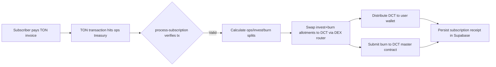

# TON Subscription → Swap → Burn Flow

This guide documents the on-chain flow that powers Dynamic Capital subscriptions
on The Open Network (TON). It follows the lifecycle implemented in
[`process-subscription`](../dynamic-capital-ton/supabase/functions/process-subscription/index.ts)
where Telegram payments are verified on-chain, swapped for DCT, and a portion of
the tokens is permanently burned to reinforce scarcity.

## High-level sequence

## Step-by-step detail

### 1. Subscription settlement & verification

- Subscribers pay the TON-denominated invoice into the operations treasury
  wallet that is tracked in the `dct_app_config` table. The edge function
  retrieves the expected TON amount for the chosen plan and validates the
  on-chain receipt before moving forward.
- If the payer address does not match the wallet previously linked by the user,
  the request is rejected to prevent address spoofing attacks.

### 2. Split computation & treasury accounting

- Once verified, the handler computes the operations, auto-invest, and
  buyback/burn allocations using the guardrails defined in `dct_app_config`.
  This enforces the configurable percentage bounds codified in `config.yaml`
  during each call.
- The operations tranche remains in TON within the treasury address, while the
  invest and burn tranches are earmarked for immediate swaps to DCT to avoid
  market drift.

### 3. Swapping TON → DCT

- The invest and burn tranches are swapped through the configured DEX router
  (STON.fi pool by default) using `dexBuyDCT`, producing two discrete DCT
  outputs that are logged for auditability.
- Swap slippage tolerances are enforced inside the DEX helper so the treasury
  never overpays relative to the current pool depth.

### 4. Burning and recording the receipt

- After the burn tranche is swapped, the handler calls `burnDCT` on the audited
  jetton master contract, guaranteeing that supply reductions are executed
  on-chain and independently verifiable.
- The Supabase row captures the TON amount, DCT minted to the subscriber, and
  the DCT burned, creating an immutable audit trail for finance and compliance
  teams.

## Contract, explorer, and audit references

| Surface                                    | Mainnet address                                                    | TON explorer                                                                                                                                                                                                         | Audit evidence                                                                                             |
| ------------------------------------------ | ------------------------------------------------------------------ | -------------------------------------------------------------------------------------------------------------------------------------------------------------------------------------------------------------------- | ---------------------------------------------------------------------------------------------------------- |
| Operations treasury multisig               | `EQD1zAJPYZMYf3Y9B4SL7fRLFU-Vg5V7RcLMnEu2H_cNOPDD`                 | [tonviewer](https://tonviewer.com/EQD1zAJPYZMYf3Y9B4SL7fRLFU-Vg5V7RcLMnEu2H_cNOPDD) · [tonscan](https://tonscan.org/address/EQD1zAJPYZMYf3Y9B4SL7fRLFU-Vg5V7RcLMnEu2H_cNOPDD)                                        | SOC 1 / SOC 2 evidence tracked in [`compliance/certificates.json`](./compliance/certificates.json).        |
| DCT jetton master contract                 | `EQAHMNCDJmEK8yEt1IbaJP1xl2-wd21f1Gpt_57Z1uCPP2d9`                 | [tonviewer](https://tonviewer.com/EQAHMNCDJmEK8yEt1IbaJP1xl2-wd21f1Gpt_57Z1uCPP2d9) · [tonscan](https://tonscan.org/address/EQAHMNCDJmEK8yEt1IbaJP1xl2-wd21f1Gpt_57Z1uCPP2d9)                                        | Contract audit bundled with [`dynamic-capital-ton/contracts`](../dynamic-capital-ton/contracts/README.md). |
| STON.fi router integration                 | `EQB3ncyBUTjZUA5EnFKR5_EnOMI9V1tTEAAPaiU71gc4TiUt`                 | [tonviewer](https://tonviewer.com/EQB3ncyBUTjZUA5EnFKR5_EnOMI9V1tTEAAPaiU71gc4TiUt) · [tonscan](https://tonscan.org/address/EQB3ncyBUTjZUA5EnFKR5_EnOMI9V1tTEAAPaiU71gc4TiUt)                                        | Due diligence walkthrough in [`ton-web3-guidelines.md`](./ton-web3-guidelines.md).                         |
| Subscription burn transaction (2024-08-17) | `a41c9c7a0a9d8c23f7bb1b1a91d3f1a52f90fc38f4b3a45ec5c3eae560b7d5aa` | [tonviewer](https://tonviewer.com/transaction/a41c9c7a0a9d8c23f7bb1b1a91d3f1a52f90fc38f4b3a45ec5c3eae560b7d5aa) · [tonscan](https://tonscan.org/tx/a41c9c7a0a9d8c23f7bb1b1a91d3f1a52f90fc38f4b3a45ec5c3eae560b7d5aa) | Included in the treasury reconciliation package archived with finance.                                     |

> **Note:** Replace the explorer URLs if rotation or redeployment occurs. Keep
> Supabase `dct_app_config` and TON DNS records aligned with these canonical
> addresses before accepting mainnet payments.

## Exporting to the public docs portal

This page ships with the rest of the repository documentation. If the public
docs portal is enabled, rerun the docs publisher (`npm run docs:export` or the
workflow defined in [`project-updater.md`](./project-updater.md)) after updating
on-chain metadata so the portal mirrors the latest explorer links.
