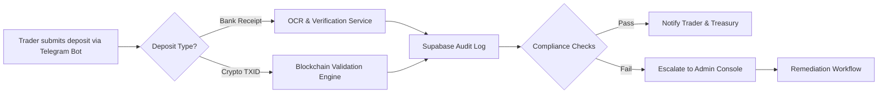
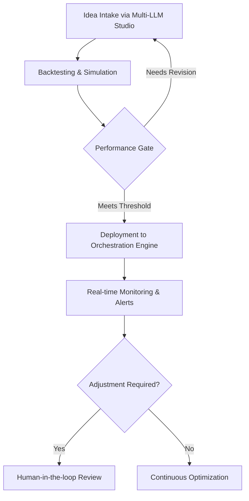

# Dynamic Capital Strategic Blueprint

## Table of Contents

1. [Executive Summary](#executive-summary)
2. [Mission, Vision, and Purpose](#mission-vision-and-purpose)
3. [Strategic Pillars](#strategic-pillars)
4. [Project Roadmap](#project-roadmap)
5. [Milestones Framework](#milestones-framework)
6. [Operating Model Flowcharts](#operating-model-flowcharts)
7. [System Architecture Overview](#system-architecture-overview)
8. [Catalog of Strategic Initiatives](#catalog-of-strategic-initiatives)
9. [Governance and Measurement](#governance-and-measurement)
10. [Index](#index)
11. [References](#references)

## Executive Summary

Dynamic Capital accelerates trader onboarding through a Telegram-first bot and
Mini App ecosystem that merges banking and crypto rails for rapid deposits. This
blueprint synthesizes the mission, long-term vision, operating models, and
roadmap milestones required to evolve the platform into a secure, multi-asset
financial command center.【F:README.md†L5-L80】

## Mission, Vision, and Purpose

### Mission

Deliver frictionless, verified capital flows for traders by unifying banking,
crypto, and automation tooling within a trusted Telegram
experience.【F:README.md†L9-L80】

### Vision

Build the default multi-asset treasury assistant that continuously adapts to
market dynamics through AI-orchestrated workflows, predictive hedging, and
real-time compliance telemetry.【F:README.md†L9-L80】

### Purpose

Empower global trading teams to deploy capital safely and instantly, enabling a
resilient economy of programmable finance built on transparent
guardrails.【F:README.md†L83-L120】

## Strategic Pillars

1. **Unified Deposit Experience** – Maintain Telegram webhook responsiveness and
   Mini App parity to guarantee a sub-second acknowledgement loop for fiat and
   crypto deposits.【F:README.md†L90-L128】【F:README.md†L154-L210】
2. **Trust & Compliance Guardrails** – Preserve immutable audit trails through
   Supabase-backed telemetry and enforce zero-touch secrets handling across
   deployment workflows.【F:README.md†L120-L200】
3. **Adaptive Intelligence** – Leverage the Dynamic AI multi-lobe fusion engine
   and Multi-LLM studio to craft predictive strategies and human-in-the-loop
   insights.【F:README.md†L11-L17】【F:README.md†L248-L320】
4. **Scalable Platform Fabric** – Extend modular microservices, edge functions,
   and queue-based automations to support new asset types, geographies, and
   partner APIs.【F:README.md†L200-L360】

## Project Roadmap

### Phase 0 — Foundation (Weeks 0–4)

- Harden Telegram bot ⇄ Mini App synchronization and ensure Supabase schemas
  cover all required audit events.
- Finalize environment configuration templates and secrets management
  runbooks.【F:README.md†L174-L320】

### Phase 1 — Intelligent Operations (Weeks 5–12)

- Deploy adaptive trade orchestration pipelines powered by the fusion engine
  with guardrail scoring.
- Instrument hedging services for real-time alerts and connect to analytics
  dashboards.
- Launch expanded admin console telemetry for proactive
  support.【F:README.md†L11-L17】【F:README.md†L248-L300】

### Phase 2 — Ecosystem Expansion (Weeks 13–24)

- Integrate additional fiat providers and crypto networks with standardized KYC
  flows.
- Introduce partner-facing APIs leveraging Supabase Row Level Security and
  service tokens.
- Roll out strategy marketplace within the Mini App for curated AI-driven
  playbooks.【F:README.md†L300-L360】

### Phase 3 — Global Scale (Weeks 25–40)

- Regionalize deployments with CDN snapshot pipelines and localized Mini App
  experiences.
- Implement cross-region replication for Supabase and failover orchestration.
- Establish governance policies for institutional onboarding and regulatory
  compliance.【F:README.md†L120-L210】【F:README.md†L320-L400】

## Milestones Framework

| Milestone ID | Phase   | Definition of Done                                                                            | KPIs                                                                   | Dependencies                        |
| ------------ | ------- | --------------------------------------------------------------------------------------------- | ---------------------------------------------------------------------- | ----------------------------------- |
| M1           | Phase 0 | Unified deposit pipeline handles bank OCR + crypto TXID with <1s webhook response time.       | Median response time ≤ 1s; 99.9% uptime.                               | Telegram bot, Supabase schemas.     |
| M2           | Phase 1 | Adaptive orchestration engine executes predictive hedges with admin observability dashboards. | ≥80% automation coverage; alert MTTR < 15 min.                         | Fusion engine, telemetry stack.     |
| M3           | Phase 2 | Partner API and marketplace launched with enforced RLS and token lifecycle management.        | 3 partner integrations; API error rate <0.1%.                          | Security policies, partner sandbox. |
| M4           | Phase 3 | Geo-resilient deployment with compliance controls validated in 3 jurisdictions.               | Zero critical incidents post-launch; compliance attestations complete. | Global CDN, legal counsel.          |

## Operating Model Flowcharts

### Deposit & Verification Flow



### Strategy Lifecycle Flow



## System Architecture Overview

```mermaid
digraph Architecture {
    rankdir=LR;
    subgraph cluster_clients {
        label="Clients";
        TelegramBot;
        MiniApp;
    }
    subgraph cluster_services {
        label="Core Services";
        OrchestrationEngine;
        HedgingService;
        AdminConsole;
    }
    subgraph cluster_infra {
        label="Infrastructure";
        SupabaseDB;
        EdgeFunctions;
        CDNStatic;
        QueueProcessor;
    }
    TelegramBot -> EdgeFunctions;
    MiniApp -> EdgeFunctions;
    EdgeFunctions -> SupabaseDB;
    SupabaseDB -> OrchestrationEngine;
    OrchestrationEngine -> HedgingService;
    HedgingService -> QueueProcessor;
    QueueProcessor -> SupabaseDB;
    AdminConsole -> SupabaseDB;
    CDNStatic -> MiniApp;
}
```

## Catalog of Strategic Initiatives

| Initiative                   | Description                                                           | Owner            | Status      | Related Milestones |
| ---------------------------- | --------------------------------------------------------------------- | ---------------- | ----------- | ------------------ |
| Adaptive Trade Orchestration | Deploy multi-LLM powered hedging and execution logic with guardrails. | Engineering Lead | In Progress | M2                 |
| Compliance Telemetry Revamp  | Expand audit logging, anomaly detection, and admin alerts.            | Security & Ops   | Planned     | M1, M4             |
| Partner API Gateway          | Launch developer portal with API keys, docs, and sandbox flows.       | Platform Team    | Planned     | M3                 |
| Global Deployment Hardening  | Implement regional rollouts, CDN snapshots, and failover drills.      | Infrastructure   | Backlog     | M4                 |
| Strategy Marketplace         | Curate AI-generated trading playbooks accessible via Mini App.        | Product          | Planned     | M2                 |

## Governance and Measurement

- **Steering Cadence:** Bi-weekly program review with leads from engineering,
  security, product, and operations.
- **Risk Management:** Maintain DO NOT MODIFY integration guardrails and enforce
  connectivity sanity checks before each release.【F:README.md†L248-L320】
- **Metrics Stack:** Centralize metrics within Supabase dashboards and feed
  anomaly alerts into the admin console for real-time
  escalation.【F:README.md†L11-L17】【F:README.md†L248-L300】
- **Feedback Loops:** Collect trader feedback via Telegram interactions,
  consolidated in the Mini App analytics workspace for prioritization.

## Index

- **Admin Console** — [Milestones Framework](#milestones-framework),
  [Operating Model Flowcharts](#operating-model-flowcharts).
- **Compliance** — [Strategic Pillars](#strategic-pillars),
  [Governance and Measurement](#governance-and-measurement).
- **Hedging Service** —
  [System Architecture Overview](#system-architecture-overview),
  [Catalog of Strategic Initiatives](#catalog-of-strategic-initiatives).
- **Mini App** — [Strategic Pillars](#strategic-pillars),
  [Operating Model Flowcharts](#operating-model-flowcharts),
  [System Architecture Overview](#system-architecture-overview).
- **Supabase** — [Strategic Pillars](#strategic-pillars),
  [Project Roadmap](#project-roadmap),
  [System Architecture Overview](#system-architecture-overview).
- **Telegram Bot** — [Project Roadmap](#project-roadmap),
  [Operating Model Flowcharts](#operating-model-flowcharts).

## References

1. Dynamic Capital README — Platform overview, features, and architectural
   guardrails.【F:README.md†L1-L360】
2. Dynamic Capital Docs — Internal repositories under `docs/` for supplementary
   playbooks and procedures (future expansion).
