# TON Data Platform Entity Relationship Diagram

This document captures the end-to-end data relationships that underpin the
Dynamic Capital TON ecosystem. It combines user identity, subscription and
billing, education, promotions, blockchain interactions, and analytics workflows
into a single model so architects and engineers can reason about dependencies
before evolving the schema.

## Diagram

```mermaid
erDiagram
    %% Core User Entities
    bot_users {
        uuid id PK
        text telegram_id UK
        text username
        text first_name
        text last_name
        boolean is_vip
        timestamptz subscription_expires_at
        uuid current_plan_id FK
        boolean is_admin
        timestamptz created_at
        timestamptz updated_at
    }
    
    profiles {
        uuid id PK
        text telegram_id UK
        text username
        text first_name
        text last_name
        text display_name
        text email
        text phone
        text avatar_url
        text role
        boolean is_active
        text ton_wallet_address
        text ton_domain UK
        boolean domain_verified
        timestamptz domain_verified_at
        timestamptz created_at
        timestamptz updated_at
    }

    %% Subscription and Payment Entities
    subscription_plans {
        uuid id PK
        text name
        integer duration_months
        numeric price
        text currency
        boolean is_lifetime
        text[] features
        timestamptz created_at
        timestamptz updated_at
    }
    
    user_subscriptions {
        uuid id PK
        text telegram_user_id UK
        text telegram_username
        uuid plan_id FK
        text payment_method
        text payment_instructions
        text bank_details
        text receipt_file_path
        text receipt_telegram_file_id
        text payment_status
        boolean is_active
        timestamptz subscription_start_date
        timestamptz subscription_end_date
        timestamptz created_at
        timestamptz updated_at
    }
    
    payments {
        uuid id PK
        uuid user_id FK
        uuid plan_id FK
        numeric amount
        text currency
        text payment_method
        text payment_provider_id
        text status
        jsonb webhook_data
        timestamptz created_at
        timestamptz updated_at
    }
    
    payment_intents {
        uuid id PK
        uuid user_id FK
        text method
        numeric expected_amount
        text currency
        text pay_code
        text status
        text notes
        timestamptz created_at
        timestamptz updated_at
    }

    %% Channel and Membership Entities
    plan_channels {
        uuid id PK
        uuid plan_id FK
        text channel_name
        text channel_type
        text invite_link
        text chat_id
        boolean is_active
        timestamptz created_at
        timestamptz updated_at
    }
    
    channel_memberships {
        uuid id PK
        uuid user_id FK
        text telegram_user_id
        text channel_id
        text channel_name
        timestamptz added_at
        uuid added_by FK
        boolean is_active
        uuid package_id FK
        timestamptz created_at
        timestamptz updated_at
    }

    %% Education System Entities
    education_categories {
        uuid id PK
        text name
        text description
        text icon
        integer display_order
        boolean is_active
        timestamptz created_at
        timestamptz updated_at
    }
    
    education_packages {
        uuid id PK
        uuid category_id FK
        text name
        text description
        text detailed_description
        numeric price
        text currency
        integer duration_weeks
        boolean is_lifetime
        integer max_students
        integer current_students
        text[] features
        text[] requirements
        text[] learning_outcomes
        text instructor_name
        text instructor_bio
        text instructor_image_url
        text thumbnail_url
        text video_preview_url
        text difficulty_level
        boolean is_active
        boolean is_featured
        timestamptz starts_at
        timestamptz enrollment_deadline
        timestamptz created_at
        timestamptz updated_at
    }
    
    education_enrollments {
        uuid id PK
        uuid package_id FK
        text student_telegram_id
        text student_telegram_username
        text student_first_name
        text student_last_name
        text student_email
        text student_phone
        text enrollment_status
        text payment_status
        text payment_method
        numeric payment_amount
        text payment_reference
        timestamptz enrollment_date
        timestamptz start_date
        timestamptz completion_date
        integer progress_percentage
        text notes
        text receipt_file_path
        text receipt_telegram_file_id
        timestamptz created_at
        timestamptz updated_at
    }

    %% Promotion and Marketing Entities
    promotions {
        uuid id PK
        text code UK
        text description
        text discount_type
        numeric discount_value
        integer max_uses
        integer current_uses
        boolean is_active
        timestamptz valid_from
        timestamptz valid_until
        timestamptz created_at
        timestamptz updated_at
    }
    
    promotion_usage {
        uuid id PK
        uuid promotion_id FK
        text telegram_user_id
        timestamptz used_at
    }
    
    broadcast_messages {
        uuid id PK
        text title
        text content
        uuid media_file_id FK
        jsonb target_audience
        timestamptz scheduled_at
        timestamptz sent_at
        text delivery_status
        integer total_recipients
        integer successful_deliveries
        integer failed_deliveries
        timestamptz created_at
        timestamptz updated_at
        text media_type
        text media_url
        text media_file_path
        bigint media_file_size
        text media_mime_type
    }

    %% TON Blockchain Entities
    ton_subdomains {
        uuid id PK
        uuid user_id FK
        text subdomain
        text full_domain UK
        text wallet_address
        boolean verified
        timestamptz created_at
        timestamptz expires_at
        timestamptz last_resolved
        timestamptz updated_at
    }
    
    ton_transactions {
        uuid id PK
        text transaction_hash UK
        text from_address
        text to_address
        text amount
        text fee
        text comment
        text purpose
        uuid user_id FK
        text status
        timestamptz confirmed_at
        timestamptz created_at
        timestamptz updated_at
    }
    
    domain_resolution_cache {
        text domain PK
        text wallet_address
        text site_url
        text storage_url
        timestamptz cached_at
        timestamptz expires_at
    }

    %% Session and Analytics Entities
    user_sessions {
        uuid id PK
        text telegram_user_id
        jsonb session_data
        text awaiting_input
        jsonb package_data
        jsonb promo_data
        boolean is_active
        timestamptz last_activity
        timestamptz created_at
        timestamptz ended_at
        text end_reason
    }
    
    bot_sessions {
        uuid id PK
        text telegram_user_id
        timestamptz session_start
        timestamptz session_end
        integer duration_minutes
        integer activity_count
        jsonb session_data
        text ip_address
        text user_agent
        timestamptz created_at
        timestamptz updated_at
    }
    
    user_analytics {
        uuid id PK
        text telegram_user_id
        text event_type
        jsonb event_data
        text user_agent
        text referrer
        text page_url
        text utm_source
        text utm_medium
        text utm_campaign
        text session_id
        inet ip_address
        text device_type
        text browser
        timestamptz created_at
    }
    
    daily_analytics {
        uuid id PK
        date date UK
        integer total_users
        integer new_users
        jsonb button_clicks
        jsonb conversion_rates
        jsonb top_promo_codes
        numeric revenue
        timestamptz created_at
        timestamptz updated_at
    }

    %% Relationships
    bot_users ||--o{ user_subscriptions : has
    bot_users ||--o{ payments : makes
    bot_users }o--|| subscription_plans : "current_plan"
    
    subscription_plans ||--o{ user_subscriptions : offered_in
    subscription_plans ||--o{ payments : paid_for
    subscription_plans ||--o{ plan_channels : includes
    subscription_plans ||--o{ user_package_assignments : assigned_in
    
    profiles ||--o{ channel_memberships : has
    profiles ||--o{ ton_subdomains : owns
    profiles ||--o{ ton_transactions : performs
    profiles ||--o{ subdomain_claims : requests
    profiles ||--o{ user_package_assignments : assigned_to
    
    education_categories ||--o{ education_packages : categorizes
    education_packages ||--o{ education_enrollments : enrolled_in
    
    promotions ||--o{ promotion_usage : used_in
    
    media_files ||--o{ broadcast_messages : used_in
    
    user_sessions ||--o{ session_audit_log : tracked_in
    user_subscriptions ||--o{ subscription_audit_log : audited_in
    education_enrollments ||--o{ enrollment_audit_log : audited_in
    
    %% Additional supporting entities (simplified relationships)
    bot_users ||--o{ user_sessions : creates
    bot_users ||--o{ bot_sessions : has
    bot_users ||--o{ user_analytics : generates
    bot_users ||--o{ user_interactions : performs
    bot_users ||--o{ conversion_tracking : tracked_in
    bot_users ||--o{ promo_analytics : uses_promo
    bot_users ||--o{ user_surveys : completes
    
    subscription_plans ||--o{ channel_memberships : grants_access
    subscription_plans ||--o{ conversion_tracking : converted_to
    subscription_plans ||--o{ promo_analytics : applied_to
    subscription_plans ||--o{ user_surveys : recommended_in
```

## Interpretation Notes

- **User Identity Split** – `bot_users` models the minimal Telegram identity
  required for automation, while `profiles` expands into richer CRM, KYC, and
  TON ownership context. The separation allows customer service and marketing
  flows to evolve independently of chat automation constraints.
- **Revenue & Fulfillment** – Billing state is distributed across
  `subscription_plans`, `user_subscriptions`, `payments`, and `payment_intents`
  to track intent, settlement, and access assignments. This ensures
  compliance-ready audit trails for both fiat and on-chain flows.
- **Learning Programs** – Education catalog tables (`education_categories`,
  `education_packages`, `education_enrollments`) capture cohort-based
  programming, seat limits, and payment metadata so educational offerings can be
  bundled with VIP subscriptions without schema drift.
- **Promotion Feedback Loop** – `promotions`, `promotion_usage`, and
  `broadcast_messages` maintain lifecycle marketing operations, enabling
  controlled rollout of promo codes and tracking message delivery quality.
- **TON Alignment** – `ton_subdomains`, `ton_transactions`, and
  `domain_resolution_cache` anchor blockchain-specific integrations. Linking
  them to user profiles keeps wallet provenance auditable and domain
  verifications enforceable.
- **Session Intelligence** – Session and analytics tables feed personalization,
  risk detection, and retention models. They close the loop between bot
  interactions and performance dashboards through audit logs and aggregated
  daily metrics.

Use this diagram to validate new features (for example, tier migrations, custom
education bundles, or TON identity upgrades) against existing relationships
before implementing migrations.
